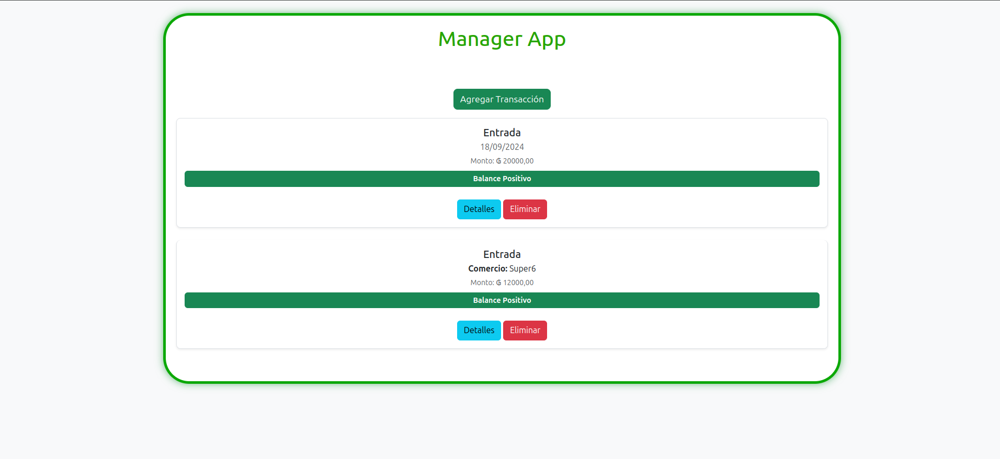
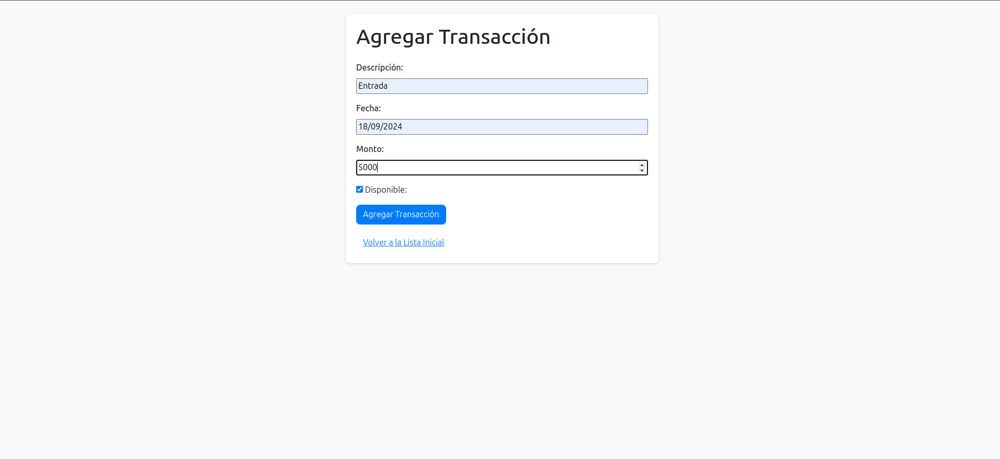
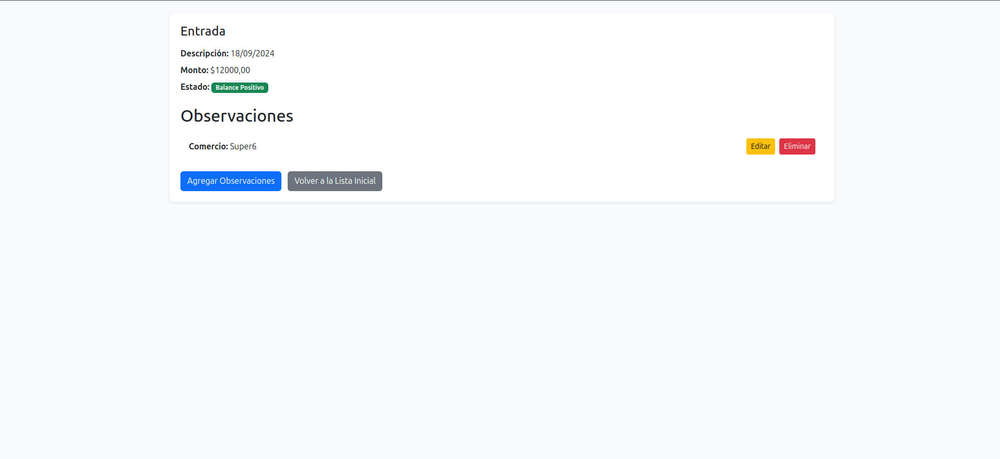
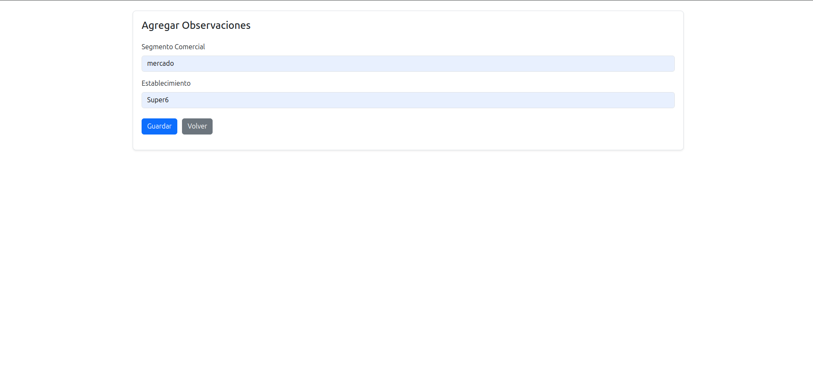
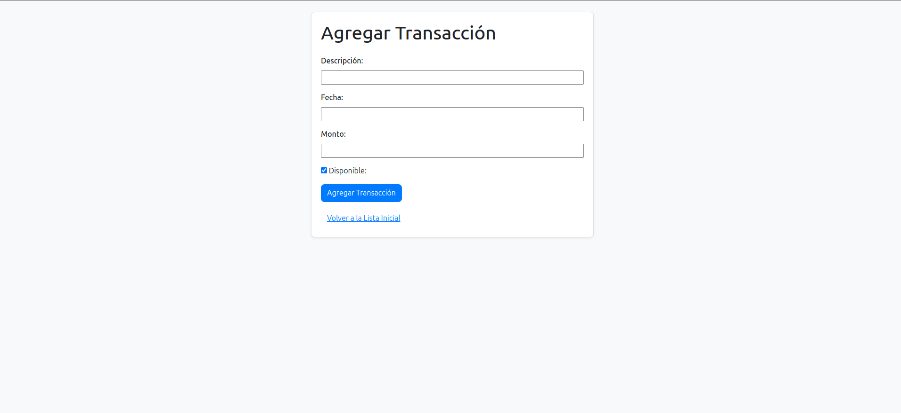
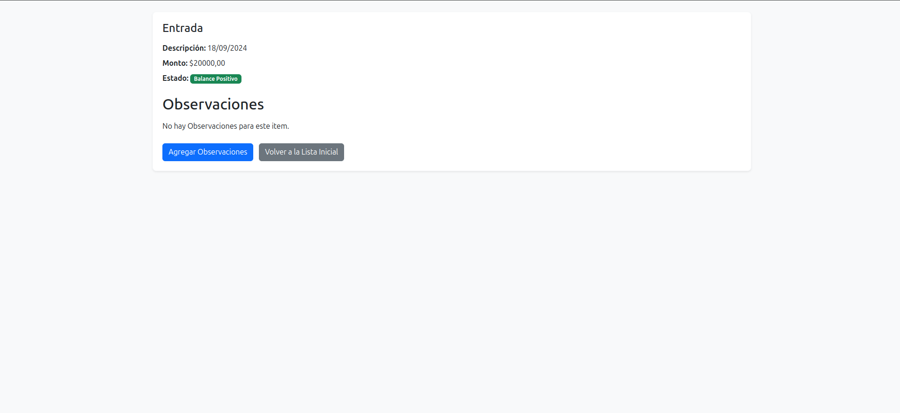

# Basic Web Application

[](https://python.org)
[](https://developer.mozilla.org/en/docs/Web/HTML)
[](https://developer.mozilla.org/en/docs/Web/CSS)
[](https://developer.mozilla.org/en/docs/Web/JavaScript)

A web page for managing a product inventory made using [Python](https://python.org), [Django](https://www.djangoproject.com/), [Bootstrap](https://getbootstrap.com/), and [PostgreSQL](https://www.postgresql.org/). The application allows listing, adding, and deleting products, adding a description, and marking them as available or unavailable. Additionally, multiple features can be added to the products.

## Technologies Used

- **Backend**: Django 5.1
- **Frontend (Templates)**: HTML, CSS, JavaScript
- **Database**: PostgreSQL
- **Others**: Bootstrap 5

## Requirements

It is essential to have the following requirements to run the project:
- Docker
- Docker Compose

## Instructions to Run the Project

1. Navigate to the repository:
   ```
   cd Fintech
   ```
2. Run the commands in a terminal:
    ```
    docker compose up --build
    ```
3. Apply the necessary migrations:
    ```
    docker compose run web python manage.py makemigrations
    docker compose run web python manage.py migrate 
    ```
4. You can create a superuser (Optional) if you want to manage the data from the Django admin interface:
    ```
    docker compose run web python manage.py createsuperuser
    ```
5. Finally, run the project on port 8000:
    ```
    docker compose up or (docker compose up --build)
    ```
6. Access the application at:

    ```
    http://127.0.0.1:8000/
    ```

7. If you encounter permission issues, run the following commands and then re-run the previous ones:

    ```
    sudo usermod -aG docker $USER
    ```
    ```
    exec su -l $USER
    ```

## Once here, you can perform all the actions allowed by the application

### Product List: You can add more products, view details, or delete products.


### Adding a New Product: You can add a new product with a description and mark it as available, or return to the home page.


### Product Details: You can add and edit features. On the home page, the description will be shown unless features are added to the product.


### Adding a Feature: This includes a title and a value, e.g., **Screen:** IPS. Multiple features can be added.


### Editing Product Features: You can edit the features of products.


## The application has alerts for adding a new product, deleting a product, or removing a feature.

### Delete Product:


### Add Product:


### Delete Feature:

